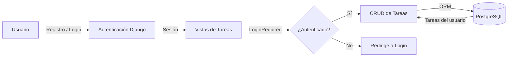

# Gestor de Tareas

Aplicación web de gestión de tareas (CRUD) construida con Django, con autenticación de usuarios y una guía paso a paso para reconstruir el proyecto desde cero.


## Tabla de Contenidos

- [Descripción](#descripción)
- [Características](#características)
- [Requisitos Previos](#requisitos-previos)
- [Instalación](#instalación)
- [Configuración](#configuración)
- [Uso](#uso)
- [Arquitectura](#arquitectura)
- [Stack Tecnológico](#stack-tecnológico)
- [Comandos Disponibles](#comandos-disponibles)
- [Testing](#testing)
- [Contribución](#contribución)
- [Roadmap](#roadmap)
- [Documentación](#documentación)
- [Soporte](#soporte)
- [Versionado](#versionado)
- [Autores](#autores)
- [Licencia](#licencia)

## Descripción

**Gestor de Tareas** es una aplicación web que permite a cada usuario registrado
crear, listar, editar y eliminar sus propias tareas, organizadas por categoría.
El proyecto nació como material educativo: además del código, incluye una
[guía paso a paso](docs/tutorial.md) que explica cómo construirlo desde cero con
Django, PostgreSQL y autenticación de usuarios.

### Flujo de Funcionamiento



## Características

- ✅ Registro, inicio y cierre de sesión con el sistema de autenticación de Django
- ✅ CRUD completo de tareas (crear, listar, editar, eliminar)
- ✅ Cada usuario sólo ve y gestiona sus propias tareas
- ✅ Categorización de tareas
- ✅ Interfaz responsiva con Bootstrap 5
- ✅ Panel de administración de Django
- 📋 API REST (planificado — ver [roadmap](docs/product/roadmap.md))

## Requisitos Previos

Antes de comenzar, asegúrate de tener instalado:

- **Python**: v3.10 o superior
- **pip**: gestor de paquetes de Python
- **PostgreSQL**: v13 o superior

## Instalación

### 1. Clonar el repositorio

```bash
git clone https://github.com/brayandiazc/gestortareas-django.git
cd gestortareas-django
```

### 2. Crear y activar un entorno virtual

```bash
python3 -m venv gestor_tareas_env
source gestor_tareas_env/bin/activate   # En Windows: gestor_tareas_env\Scripts\activate
```

### 3. Instalar dependencias

```bash
pip install -r requirements.txt
```

### 4. Configurar variables de entorno

```bash
cp .env.example .env
# Edita .env con tus credenciales de base de datos y una SECRET_KEY nueva
```

### 5. Crear la base de datos y aplicar migraciones

```bash
python manage.py migrate
python manage.py createsuperuser   # opcional, para el panel de administración
```

## Configuración

Las variables de entorno se documentan en [`.env.example`](.env.example).
Cópialo a `.env` y completa los valores para tu entorno.

> Nunca subas tu archivo `.env` con valores reales al repositorio.
> Ver [SECURITY.md](SECURITY.md) y [`docs/conventions/secrets.md`](docs/conventions/secrets.md).

## Uso

### Desarrollo local

```bash
python manage.py runserver
# La aplicación quedará disponible en http://127.0.0.1:8000
```

Rutas principales:

| Ruta                  | Descripción                          |
| --------------------- | ------------------------------------ |
| `/`                   | Lista de tareas del usuario          |
| `/tareas/nueva/`      | Crear una nueva tarea                |
| `/registro/`          | Registro de nuevos usuarios          |
| `/accounts/login/`    | Inicio de sesión                     |
| `/accounts/logout/`   | Cierre de sesión                     |
| `/admin/`             | Panel de administración de Django    |

## Arquitectura

Aplicación Django monolítica con renderizado del lado del servidor. Se organiza en
dos apps de dominio (`usuarios` y `tareas`) sobre el proyecto `gestor_tareas`.
Detalle completo en [`docs/architecture/architecture.md`](docs/architecture/architecture.md).

## Stack Tecnológico

- **Backend**: Python 3.10+, Django 5.1
- **Base de datos**: PostgreSQL (vía `psycopg2`)
- **Frontend**: Plantillas de Django + Bootstrap 5
- **Configuración**: variables de entorno con `python-dotenv`

Inventario completo (con versiones y justificación) en
[`docs/architecture/stack.md`](docs/architecture/stack.md).

## Comandos Disponibles

```bash
python manage.py runserver        # Iniciar el servidor de desarrollo
python manage.py migrate          # Aplicar migraciones
python manage.py makemigrations   # Generar nuevas migraciones
python manage.py createsuperuser  # Crear un superusuario
python manage.py test             # Ejecutar los tests
```

## Testing

```bash
python manage.py test
```

Convenciones de testing en [`docs/conventions/testing.md`](docs/conventions/testing.md).

## Contribución

Lee la [Guía de Contribución](CONTRIBUTING.md) para conocer el flujo de trabajo
(Git Flow), los estándares de código, el formato de commits
(Conventional Commits) y el proceso de Pull Requests.

## Roadmap

Visión y próximos pasos en [`docs/product/roadmap.md`](docs/product/roadmap.md).

## Documentación

Toda la documentación vive en [`docs/`](docs/README.md):

| Documento                                                                | Responde a                       |
| ------------------------------------------------------------------------ | -------------------------------- |
| [`docs/tutorial.md`](docs/tutorial.md)                                   | ¿Cómo se construye paso a paso?  |
| [`docs/architecture/architecture.md`](docs/architecture/architecture.md) | ¿Cómo está construido?           |
| [`docs/architecture/stack.md`](docs/architecture/stack.md)               | ¿Con qué tecnologías?            |
| [`docs/architecture/database.md`](docs/architecture/database.md)         | ¿Qué entidades y relaciones?     |
| [`docs/architecture/auth.md`](docs/architecture/auth.md)                 | ¿Cómo se autentica y autoriza?   |
| [`docs/product/roadmap.md`](docs/product/roadmap.md)                     | ¿Hacia dónde va?                 |
| [`docs/decisions/`](docs/decisions/README.md)                            | ¿Por qué tomamos cada decisión?  |
| [`docs/conventions/`](docs/conventions/README.md)                        | ¿Cómo trabajamos en este repo?   |

## Soporte

¿Problemas o sugerencias? Abre un issue en
[el repositorio](https://github.com/brayandiazc/gestortareas-django/issues)
o escribe a brayandiazc@gmail.com.

## Versionado

Usamos [Git](https://git-scm.com) para el control de versiones y seguimos
[Semantic Versioning](https://semver.org/). Consulta las
[etiquetas](https://github.com/brayandiazc/gestortareas-django/tags) para ver las
versiones disponibles y el [CHANGELOG](CHANGELOG.md).

## Autores

- **Brayan Diaz C** — _Trabajo inicial_ — [@brayandiazc](https://github.com/brayandiazc)

## Licencia

Este proyecto está bajo la licencia [MIT](LICENSE).

---

⌨️ con ❤️ por [@brayandiazc](https://github.com/brayandiazc)
