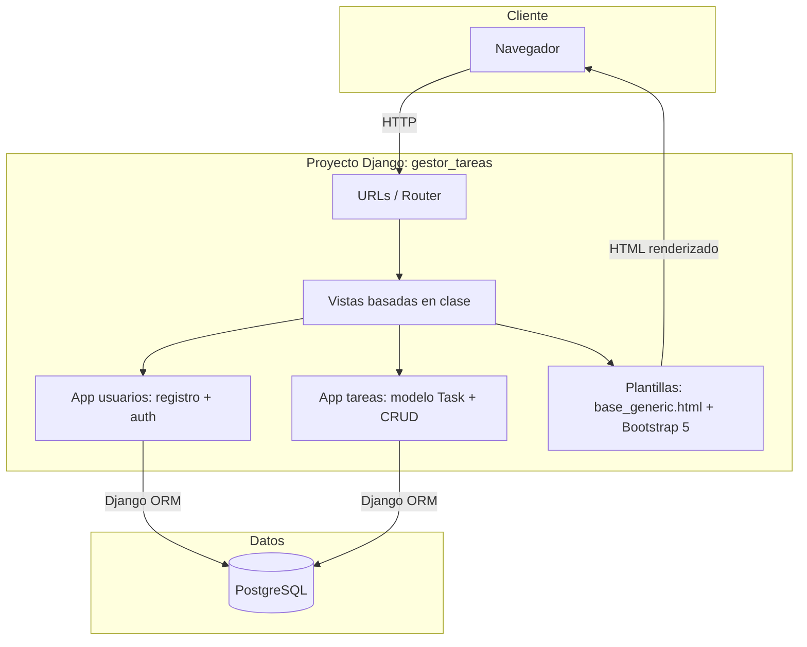
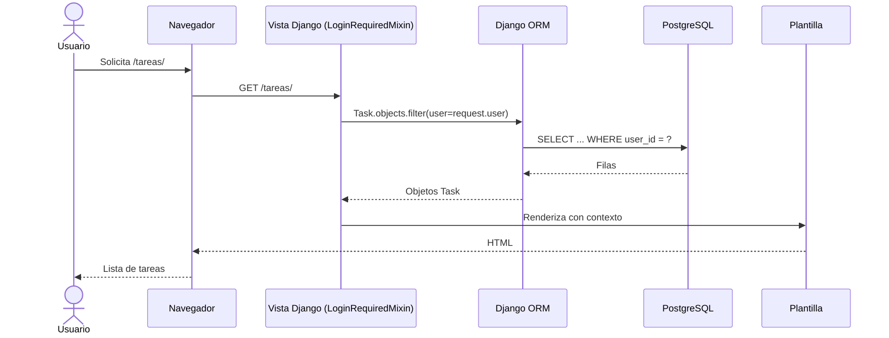

# Gestor de Tareas — Arquitectura

> Vista de alto nivel de cómo está construido el sistema y cómo se reparten las
> responsabilidades. Para el stack real (versiones, librerías) ver
> [`stack.md`](stack.md). Para el negocio ver
> [`../product/business-model.md`](../product/business-model.md).
>
> **Última actualización**: 2026-07-02

## Diagrama

## Componentes

| Componente        | Responsabilidad                                              | Tecnología       |
| ----------------- | ----------------------------------------------------------- | ---------------- |
| Proyecto `gestor_tareas` | Configuración global, enrutado de URLs y settings del sitio | Django 5.1.2 |
| App `usuarios`    | Registro de usuarios (`CreateView` con `UserCreationForm`); reutiliza el modelo `User` estándar de Django y `django.contrib.auth.urls` | Django auth |
| App `tareas`      | Modelo `Task` y CRUD de tareas con vistas basadas en clase y `LoginRequiredMixin` | Django ORM |
| Capa de plantillas | Renderizado server-side con `base_generic.html`, `registration/` y componentes de Bootstrap 5 | Plantillas Django + Bootstrap 5 |
| Persistencia      | Almacenamiento relacional de usuarios y tareas               | PostgreSQL (`psycopg2-binary`) |

## Decisiones clave

| Decisión                                    | Razón                                                                 |
| ------------------------------------------- | --------------------------------------------------------------------- |
| Arquitectura monolítica Django (patrón MTV) | Simplicidad para un CRUD; un solo despliegue, sin frontend separado.  |
| Renderizado del lado del servidor sin API REST | Menos superficie y complejidad; las plantillas de Django bastan para la UI. |
| Reutilizar el modelo `User` estándar de Django | Evita mantener un modelo de usuario propio y aprovecha el sistema de auth integrado. |
| Autorización por filtrado de queryset (`request.user`) | Cada usuario solo accede a sus propias tareas sin lógica de permisos adicional. |

> El detalle y las alternativas de cada decisión relevante se registran como
> ADRs en [`../decisions/`](../decisions/README.md).

## Reglas no negociables

- Un usuario solo puede ver y modificar sus propias tareas: todas las vistas de tareas filtran el queryset por `request.user`.
- Todas las vistas de tareas requieren sesión iniciada (`LoginRequiredMixin`); no hay acceso anónimo al CRUD.

## Flujos principales

## Referencias

- [`stack.md`](stack.md) — stack tecnológico y versiones.
- [`database.md`](database.md) — modelo de datos.
- [`auth.md`](auth.md) — autenticación y autorización.
- [`api.md`](api.md) — contrato de API.
- [`../conventions/`](../conventions/README.md) — convenciones de trabajo.
