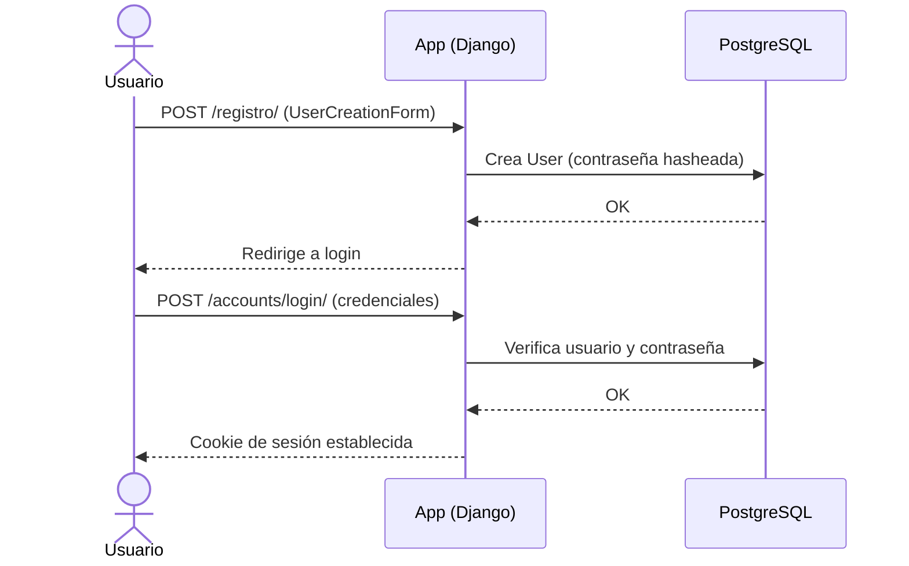

# Autenticación y Autorización

> Cómo se autentican y autorizan los usuarios en **Gestor de Tareas**.
> Para las reglas transversales ver [`../conventions/authentication.md`](../conventions/authentication.md).
>
> **Última actualización**: 2026-07-02

## Visión general

- **Método de autenticación**: Sesión de Django (sistema de auth integrado, `django.contrib.auth`). Se incluye `django.contrib.auth.urls` bajo `/accounts/` (login, logout, password_change, etc.).
- **Almacenamiento de credenciales**: En la tabla del modelo `User` estándar de Django, en PostgreSQL. Las sesiones se gestionan mediante cookies de sesión de Django.
- **Hashing de contraseñas**: El de Django por defecto (PBKDF2 con SHA256); nunca se almacenan contraseñas en texto plano.

## Modelo de identidad

| Concepto       | Descripción                                                                 |
| -------------- | --------------------------------------------------------------------------- |
| Usuario        | Modelo `User` estándar de Django (`django.contrib.auth.models.User`), sin modelo propio; campos clave: `username`, `password`, `email`. |
| Sesión / Token | Sesión de servidor de Django identificada por una cookie de sesión; no se usan tokens JWT. |
| Roles          | No hay roles de negocio propios; existe la distinción estándar de Django entre usuario normal y superusuario/staff (acceso al admin). |

## Flujo de registro / login

## Gestión de sesiones / tokens

- **Expiración**: Según la configuración de sesiones de Django (por defecto, la cookie expira al cerrar el navegador / `SESSION_COOKIE_AGE`).
- **Renovación**: La sesión se mantiene mientras el usuario navegue autenticado; no hay refresh tokens (no se usa JWT).
- **Revocación**: El logout (`/accounts/logout/`) invalida la sesión del usuario.

## Autorización

- **Modelo**: Autorización a nivel de objeto por filtrado de queryset. Las vistas de tareas usan `LoginRequiredMixin` y filtran por `request.user`, de modo que cada usuario solo ve y opera sobre sus propias tareas.
- **Dónde se valida**: siempre en el servidor, en cada request.
- **Roles y permisos**:

| Rol                     | Permisos                                                                 |
| ----------------------- | ------------------------------------------------------------------------ |
| Usuario autenticado     | CRUD completo sobre sus propias tareas (creadas por él, filtradas por `request.user`); sin acceso a las tareas de otros. |
| Superusuario / staff    | Acceso al panel de administración de Django (`/admin/`) además de sus tareas. |

## Proveedores externos (OAuth / SSO)

- No aplica en esta versión: no se integran proveedores OAuth ni SSO. La autenticación es local con el sistema de Django.

## Recuperación de cuenta

- El sistema de auth de Django expone las vistas de cambio y restablecimiento de contraseña vía `django.contrib.auth.urls` bajo `/accounts/` (p. ej. `password_change`, `password_reset`). El envío de correos de reset depende de la configuración de email del entorno.

## Consideraciones de seguridad

Ver [SECURITY.md](../../SECURITY.md) para la política completa.
