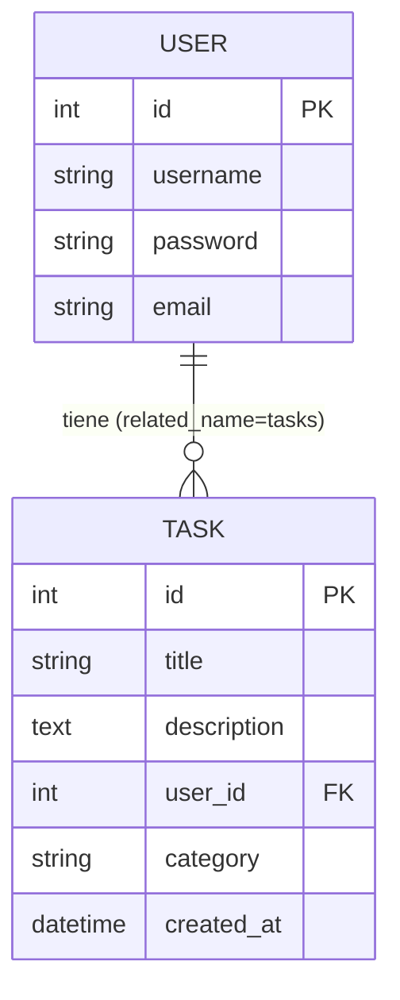

# Modelo de Datos

> Esquema, entidades y relaciones de **Gestor de Tareas**.
> Para las **reglas y estándares** de modelado (nomenclatura, tipos, índices)
> ver [`../conventions/database.md`](../conventions/database.md).
>
> **Última actualización**: 2026-07-02

## Diagrama Entidad-Relación

## Entidades principales

### User (django.contrib.auth.models.User)

- **Propósito**: Representa al usuario autenticado del sistema. Se usa el modelo `User` estándar de Django sin extenderlo.
- **Campos clave**: `id` (auto), `username`, `password` (hasheada por Django), `email` — gestionados por el sistema de autenticación de Django.
- **Relaciones**: Un `User` tiene N `Task` (relación 1:N, accesible como `user.tasks`).

### Task (tareas/models.py)

- **Propósito**: Representa una tarea creada por un usuario.
- **Campos clave**:
  - `title` (CharField, max_length=255) — título de la tarea.
  - `description` (TextField, `blank=True`, `null=True`) — descripción opcional.
  - `user` (ForeignKey a `User`, `on_delete=CASCADE`, `related_name="tasks"`) — dueño de la tarea.
  - `category` (CharField, max_length=100) — categoría de la tarea.
  - `created_at` (DateTimeField, `auto_now_add=True`) — fecha de creación.
- **Meta**: `ordering = ["-created_at"]` (las tareas más recientes primero). `__str__` devuelve `title`.
- **Relaciones**: Cada `Task` pertenece a un único `User` (N:1).

## Relaciones y cardinalidad

| Relación      | Cardinalidad | Notas                                                             |
| ------------- | ------------ | ----------------------------------------------------------------- |
| User → Task   | 1:N          | `ForeignKey` con `on_delete=CASCADE`: al borrar un usuario se eliminan sus tareas. |

## Índices y restricciones

- Clave primaria autoincremental (`id`) en ambas tablas, generada por Django.
- Índice sobre la columna `user_id` de `Task`, creado automáticamente por Django para la `ForeignKey`.
- Restricción de integridad referencial `Task.user_id → User.id` con borrado en cascada.

## Migraciones y versionado del esquema

- Las migraciones se generan con `python manage.py makemigrations` y se aplican con `python manage.py migrate`.
- Django mantiene el historial de migraciones por app; se versionan en el repositorio para reproducir el esquema.

## Datos semilla (seeds)

- El proyecto no incluye datos semilla automatizados en esta versión. Para crear un usuario administrador se usa `python manage.py createsuperuser`.
